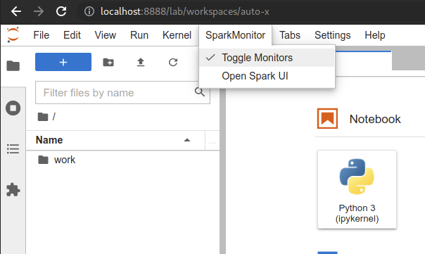
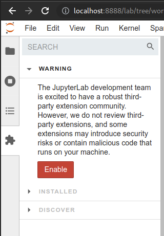

# JupyterLab Server 


_But that which will excite the greatest astonishment by far, and which indeed especially moved me to call the attention of all astronomers and philosophers, is this: namely, that I have observed four planets, neither known nor observed by any one of the astronomers before my time, which have their orbits round a certain bright star, one of those previously known, like Venus or Mercury round the sun, and are sometimes in front of it, sometimes behind it, though they never depart from it beyond certain limits. All of which facts were discovered and observed a few days ago by the help of a telescope devised by me, through God’s grace first enlightening my mind. ~ The Sidereal Messenger - Galileo Galilei [1620]_ 

### Contents
- [Introduction](#introduction)
  - [Features](#features)
  - [Current Issues](#current-issues)
- [Getting Started](#getting-started)
  - [Building](#building)
  - [Operation](#Operation)
  - [Access](#access)
  - [Spark Monitor](#spark-monitor)
- [Passwords](#passwords)

### Introduction

This repository contains configuration to establish a `Docker` container using `Docker Compose` to run `JupyterLab` with the `Pyspark` kernel. It includes the installation of `Plotly` for interactive visualisations and `Spark Monitor` for observing job progress inside the notebook environment.

It is based off the `jupyter/pyspark-notebook:latest` container, which in turn is based of the `jupyter/scipy-notebook:latest` container. All of the standard `JupyterLab` modules are included here.

#### Features


- [Jupyter Lab 3](https://github.com/jupyterlab/jupyterlab)
- [Pyspark 3](https://github.com/apache/spark/tree/master/python)
- [OpenJDK JRE 11](https://github.com/openjdk/jdk)
- [Plotly](https://github.com/plotly/plotly.py)
- [Spark Monitor](https://github.com/itsjafer/jupyterlab-sparkmonitor#readme)
- Default `jovyan` user password [`jupyter`] with sudo rights for installing additional packages in the terminal
- WARN logging is disabled in Pyspark to reduce messages in notebooks

#### Current Issues

- Spark throws a warning on first start for Illegal Reflection detailed here: [Spark-34096](https://issues.apache.org/jira/browse/SPARK-34095)
- The `.ipython` environment is stored inside the contain and will not persist through container `rm` and `up -d` cycles. This is due to the inclusion of `Spark Monitor`, but could be improved later.

### Getting Started

First ensure that the following pre-requisites are installed:

- [Docker](https://docs.docker.com/get-docker/)
- [Docker Compose](https://docs.docker.com/compose/install/)

If running Ubuntu, IP forwarding was required. `ufw` was also blocking `apt` initially.

```bash
sudo sysctl -w net.ipv4.ip_forward=1
sudo systemctl stop ufw
```

#### Building

Once `docker-compose` is available in the system path, build the container:
```bash
sudo docker-compose build jupyterlab-pyspark
```

#### Operation

```bash
sudo docker-compose up -d jupyterlab-pyspark
Starting jupyter-pyspark ... done
```

Any additionally installed packages will persist if the container is stopped. The container can then be easily restarted later. Stopping the container will prevent it starting automatically on the next system reboot.
```bash
sudo docker-compose stop jupyterlab-pyspark
sudo docker-compose restart jupyterlab-pyspark
```

Removing the container will lose any additionally installed packages or configuration.
```bash
sudo docker-compose rm jupyterlab-pyspark
```

#### Access

`JupyterLab`

Once the container has started, open a browser and navigate to: [localhost:8888](http://localhost:8888)<br/>
The default password as configured is: `jupyter`

`Spark UI`

Once a Pyspark session has been started, the Spark UI can be accessed using: [localhost:4040](http://localhost:4040)


#### Spark Monitor

In order to see the Spark Monitor in a notebook, the SparkMonitor menu item `Toggle Monitors` needs to be enabled. The Spark UI can also be access directly in JupyterLab using the `Open Spark UI` menu item.


<br/><br/>

Sample of a Spark Monitor in operation:


#### Sample Notebook

Try out the sample notebook in the work directory to test out `pyspark` and `plotly`.


#### Extensions

JupyterLab containers searchable and installable extensions. Click on the plugin icon in the left nav bar, and then click `Enable` after reading and understanding the warnings. This should not be required for `Spark Monitor` to function.



### Passwords

Passwords can be modified for both the Jovyan user in the [Dockerfile](Dockerfile) or for the JupyerLab server in the [docker-compose.yml](docker-compose.yml).

### `JupyterLab`

To create a new `JupyterLab` password, in a JupyerLab terminal, start `python3` and run the following:
```python
>>> from notebook.auth.security import passwd
>>> passwd(algorithm='sha256')
Enter password: 
Verify password: 
'sha256:43139058e8c2:93c969c8d629577ee253084c018cf9b169d87e3191a61e846c61146f5e820a04'
```
This can be be substituted in the [docker-compose.yml](docker-compose.yml) file.

### `Jovyan`

To create a different `jovyan` user password in the container, start a JupyterLab terminal and run the following:

```bash
echo 'passowrd' | openssl passwd -5 -stdin
```

The password can be substituted in the [Dockerfile](Dockerfile). The `echo` command needs the `jovyan:` user string and colon to precede the hashed password.